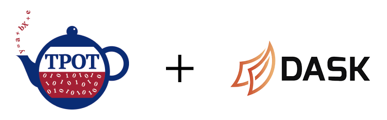

# AutoML with TPOT

The notebook in this repo demonstrates automated machine learning using TPOT on a sample of [credit card fraud data](https://www.kaggle.com/mlg-ulb/creditcardfraud).
AutoML is compute intensive, so to speed up the wall-clock time of the computation, we distribute compute over a [Dask](https://dask.org/) cluster, which we create ad-hoc using the CML [Workers API](https://docs.cloudera.com/machine-learning/cloud/distributed-computing/topics/ml-parallel-computing.html).

## Deploying on Cloudera Machine Learning (CML)

There are three ways to launch this project on CML:

1. From AMP Catalog - Navigate to the AMP Catalog in a CML workspace, select the "AutoML with TPOT" tile, click "Launch as Project", click "Configure Project".
2. As ML Prototype - In a CML workspace, click "New Project", add a Project Name, select "ML Prototype" as the Initial Setup option, copy in the repo URL, click "Create Project", click "Configure Project"
3. Manual Setup - In a CML workspace, click "New Project", add a Project Name, select "Git" as the Initial Setup option, copy in the repo URL, click "Create Project". In this case, the dependencies in `requirements.txt` must be manually installed. Open up a session and install with `pip install -r requirements.txt` in the terminal. (For legacy engines, replace `pip` with `pip3`).

Once the project has been initialized in a CML workspace, run the `automl.ipynb` notebook by starting a Python 3 JupyterLab or notebook session.
